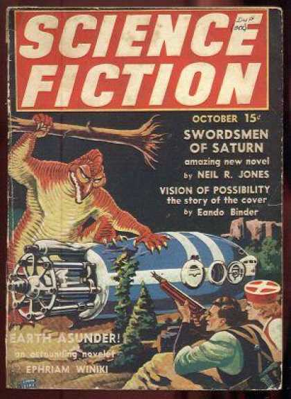

</img></img></img></img>
# SciFi book generator

The purpose of this project is to build a decoder only transformer architecture from scratch and train it to autogenerate SciFi stories based on transcripts from pulp magazines.

## Project structure 

```

```


## Resources

* Dataset: [Kaggle SciFi Stories Text Corpus](https://www.kaggle.com/datasets/jannesklaas/scifi-stories-text-corpus?resource=download)
* Working environment pre-requisites: Ubuntu18.04 LTS / Python 3.6.9 / virtualenv / CUDA version >=11.6