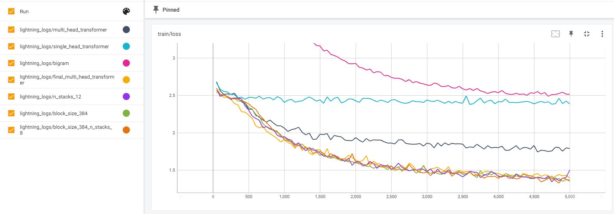

</img></img></img>
# SciFi book generator

The purpose of this project is to build a decoder only transformer architecture from scratch and train it to autogenerate SciFi stories based on transcripts from pulp magazines. The approach taken in the code is inspired by the original [Attention is all you need](https://arxiv.org/abs/1706.03762) as well as [Andrej Karpathy's coding implementation](https://www.youtube.com/watch?v=kCc8FmEb1nY)

## Resources

* Working environment pre-requisites: Ubuntu18.04 LTS / Python 3.6.9 / unzip / virtualenv / CUDA version >=11.6
* Dataset: [Kaggle SciFi Stories Text Corpus](https://www.kaggle.com/datasets/jannesklaas/scifi-stories-text-corpus?resource=download) - use: `make download-dataset` to collect


## Project structure 

```
├── data                             # project source data
├── environment                      # project dependencies 
├── output                           # stored PyTorch Lightning output of training
└── src                              # project source code
    ├── dataset                      # dataset creation tools
    ├── model                        # model definitions
    |     └── transformer_modules    # transformer element definitions
    └── tokeniser                    # text tokenisers
```

## Makefile

The project [Makefile](Makefile) allows performing the following tasks by typing the following commands in terminal from the project root:

* `create-env` - build virtual environment to run the project code
* `activate-env-command` - generate command to activate the project virtual environment
* `download-dataset` - download the Kaggle dataset (requires Kaggle account and token)
* `run-training` - run training based on the contents of [train.py](src/train.py)
* `purge-output` - deletes all output generated by PyTorch Lightning after the training
* `run-tensorboard` - creates link to tensorboard with training results

## Project overview & findings

### Data

The following tokenisers have been implemented for use:
* character tokenisation
* sub-words by [tiktoken](https://github.com/openai/tiktoken) 

Given the limited offline resources (GTX 1060 with 6GB VRAM), we resorted to using the character tokenisation for the purpose of this analysis.

### Training

Training was performed on the following architectures:
* [bigram (baseline)](src/model/bigram_model.py)
* [single head transformer](src/model/single_head_transformer.py)
* [multi head transformer (single stack)](src/model/multi_head_transformer.py)
* [multi head transformer (multiple stacks)](src/model/final_multi_head_transformer.py)
* multi head transformer (multiple stacks) - hyperparameter tuning

Models were trained on the typical language modelling task of autocompleting a sequence of tokens. To allow fair comparison, all models were trained on approximately 5k batches and evaluated on 500 holdout batches using cross entropy loss. Where possible, the same hyperparameters were used in all approaches to allow more fair comparison (see [config](src/config.py))

The result overview from tensorboard can be seen below:




**Bigram model**

As baseline a bigram model was trained with 5.6K trainable parameters, reaching the validation loss of 2.45. Given the naive approach (basically predicting the next character given a lookup table based only on the current character), the model output is little more than pure giberish:

> ujC; d ashepea thisand. lyoThengowabosiofazer. hePan ave. ane scu d,he pll atinr tete thomowanogl.V. Yogasow,"I Bantrelsisn miphex ng t58Pl !quowin ) s, whe tho6gulldiUn d. venoomere histitheang. J. butrerexed ged He coom mang wheerly gxcQenlworouritheniUy w!ainongerind toblery pou!A af mbe se. th thilller aned cr ulis?" " wange Norv! f t lirgacote anewas me wnsinechot."Gr pld She the wabrighe f prrthittheay sn cin ps whexphie Ap vetMurein" we errototughis omole laredm: Cotsa bet mbo3Nofinot) d. 'tl lugrend."Hesharche?u ot1ze sppflefoul. oraimeywative. the Muntan wamemamer, sainewhelhe w seviond. in org r, Z, wa ave, d sabl rcu aing cang "Por L'doof I've c7any hending a ugn seresulaYe te sKar-Latoum "Anes. Ther. he m o h hined s cienotoupeacrty he. to woutanghiemorivie ut I4Ut "I gDomof ! b be wat, touguke, tJegio inrs commalod ancerevck yeak y an ake ornejorbyG78Lor here Kio lect44ugher ecquns and aRomeCabec2Lal Hat wiasthis elly ld edu masuo! g hatlale t7PkNoul ctangintherwhed wof The


**Single head transformer**

The next approach used was a very basic transformer implementation, using only a single self-attention head with 598K trainable parameters. This allowed the validation loss to drop to 2.28, with the following sample output:

> (  oirg oncthe apce imstyo kact heeve tis. doonwand, odupperon hipthe hankeripn. Hee nopothery stioveecenely onw he boustinereneretey Best tap adr bee wo to nkeand cildin an. Thergiforct his that hiames:mon f-n. Weher ieve ashy Don. Tr fork bo utre pesepll, pply ih pingge."Singunsed ss beenende aly wising hed'm cancung stedas an rins sal the ck...  tt bastveers's and latk, borne Sctim -veslolele s jipakemsoak for haly pet andi nol?  tm gutile woou alno wh ting sthe id. "I net oing tand on se hereculdd rald atr oft ig, dsenck younet f sill? Wof witho corrceds feverd hofurpocs, I be the frllamoudlllet. Atte iby woused. Wamlickse avanin teand epthe one joulllinto day ppereed Fs thre ow, for he se os nestanvee idziten ve hof upreird. Andcol. Deninglat am soniocer stoun wsser sero beto ss fioldid, al, too roftired lest rceler) verspeanwofd dnne. Unt to wicl or ringinnd, thamitheyyu sa nimauts mprk smia bork blisieclon, ave gopo biscin ske, tthirlet Thaade. "Dingeatt theeadn'l nedr, Coow thal


Progress compared to the bigram approach is minimal.


**Multi-head transformer - single stack**

Next, a transformer with six self-attention heads (in a single decoder stack) was trained. With 1.9M trainable parameters we used a smaller learning rate to train the architecture. This architecture managed to achieve a validation loss of 1.59. This is an example random generated output from the network:

> 1mong as us turne-played in on matter arrial, word slowarmlears. I has to evitualizaras timod a was now it that of a murced in wonder as warf against to it with fron's row," Plearse," he time what sible, Righn too." New for on.. And robot," Brunned man mport owere not at of aving to do," he said, "I was mai t lice sual veleving pement on seezed a your composs fored wered through momes on said. His such that your field of find the baracks, "You're takes own so ave -- anyway from Himbad the you or comptionion. Mybe. Pl he in dorankfashed a but the did a a but it, it Claution on I have insultants." The Enory F Cluff desters, forticreten fly now up grave ubt ourse. I shappred tilt ened the prote haved that's a crace abought doesn't been trifice, the last Igened the bask, but to show halve back cate deved as so a homput that aliy? She sadvant was it?" let thered bulb. We hop-so be the resoltern roble new we was alone any enew skiruter is por-ped in Coxident blurium?" All I've nly reg. What t

This time around we can clearly see actual english words emerging from the output, although there's still a number of incorrect wordlike sequences.

**Multi-head transformer - multiple stacks**

Lastly, a multi-head transformer with six decoder stacks - with six attention heads each - was used. This pushed the number of trainable parameters to 10.8M, increasing the training time accordingly compared to previous approaches. Again, a smaller learning rate was used given the network depth. The final validation loss achieved was 1.34, with signs of possible further improvement. 

Example generated output:

> ch, improbably. All I gave the young." His byth dialty near Edithbon was relying step on the world -- and a leathing for the other remoments, and he long me sod. "I have insurprised when he left the door than with a bit death." Verjice more said with the newchnthrough Running his head difficulty metal and flesh signs. "Imporable them my better attack?" Parkers torribly turned up to Her around, streaking of her body, toward, he gave a case entered cubic chaoscilence. He had slipped away a vehicle for succession three years and the short of life, leaves swinging here at the black and treatment, only trailing it on this massive shape, but would ever be called to do with armuda. "Sorry?" he clusted the day. "We don't not took Money to make all this company of nothing feed." "Those project. Our polite is no isn't about weeks," Retief said, "took your own." "It stood before we don't mean wait to keep about the field." That's the planet uncase the olde attendance from it?" "I'm goting to pract

This time around the output actually looks like lines from a book. Of course, there is little cohesion in the sentences themselves. However given the still relatively shallow nature of the architecture compared to gigantic architectures like GPT-3, this can be considered an impressive result.

**Multi-head transformer - hyperparameter tuning**

Exploring the limits of the GPU capabilities available for training, several other experiments were performed:

1. multi-head transformer with number of decoder stacks increased to 12. This pushed the number of trainable parameters to 21M. During training loss followed a pattern very similar to the multi-head with 6 decoder stacks, but the validation loss result was slightly better - 1.32. Sample output:
    > Suberific had not squatted her long house signs but her winded sniffles in hers. After metal, as Blanda, the Argomonovie was warning since, my ship after a venus in the pregent had been, like him after a smartly times all the Cat Earth, Barac A serial recreased whatever he was already. He pounded him and was aspectly in the Dor. And still called to me that there will folly him. It was a vair light. The mans of the children had too faster and then it was a hoarding days. He had left Eric started warmly. The giggly ticles of the Godternmojobs, of course, fashion -- her -- every or many day and these would desegment it digest before her is old letting expression. But he saw her speed and the motion of their own shadows, for it was. He felt as like a moment of ordinary formuls and saw the various new John and the finger, sot of them that he might always, mame or his deep. They were made him his hand so well, his was a brive rode, wfailing from the nerves of him... It considered him one shif
1. multi-head transformer with the sequence length (`BLOCK_SIZE`) increased from 256 to 384. While the number of trainable parameters increased only slightly (11M) and training loss also behaved similarily, the validation loss dropped to 1.3. Sample output:
    > Kith Lamager of the nurse by a day-board, the people were carried like until survo-thought-throated characters cross his personal sustem, on father once the moment of steam-ship actual iience and good fareless a lot of mailine centers whens perspite on a hill. The crewpowerful actually is superfaced to be in a finished conduction. . The restructions certainly added the girl were until and, opinioning, immerced up the resultances which seemed he imagined, disturbed the lowers radiator managed: "Free years!" Smilth readed the beam of the elebrower left flats and radiolutic spiral works. "He's always," Robert said. She meals brought the hour and watch sun: "Right?" she said closer, rosebbered a few teeth floor around the stars. Her brains liqued, the couple better haired in the seconds, he knew getting running everyone steadile between her hazacroscapes whatever. "Free-reproved Mass Avenue," he asked, gruddling and cracked rooms, objectively shut her. "I spend my lap," Kirka said, "However
1. multi-head transformer with sequence length of 384 and number of stacks increased  to 8. With the default batch size and 15M trainable parameters, this architecture nearly took all of the available 6GB VRAM. It also achieved the best validation loss result - 1.28. Sample output:
    > me both. The groom along, "Let me notice I'll excell class soon, the indition you darling thing in business confix, from us turn in the rain of appears. Man Cord got automatic publishing the game I got a drift. Denigor's teeth -- publishing hole -- one of the priances for people. This is just have been wishined, darling, and is also correspance, I will see the best of week-stretched members of ploy and crying against warges. Boys this seemed, but then somewhat was about it? Quiter mercently emissed while I ere sprayed our sprence from your cruzy and ears on. I never stopped a platfe bottle, my men I felt the idea of the best plastic streets of his uniform he expected the annoyed squintly time everything to peace himself. Committer had pended over the room by face and was his first machine, but it constructed his phone to be some or much annoyance. Once the closes of the club that weren't the white Plottic Mister ws being an inside of the similar aside. The Andid saw long to Jig talk ove

### Conclusions

Even with the limited resources used for training we achieved relatively impressive results in text generation. Having compared the champion architecture with the likes of GPT-3 it is easy to see that the more parameters and the longer the sequences used for training - the better the network generalisation. To achieve the next breakthrough here we would probably need to:
* switch to sub-word tokenisation
* increase sequence length
* widen and deepen the decoder stack implementation